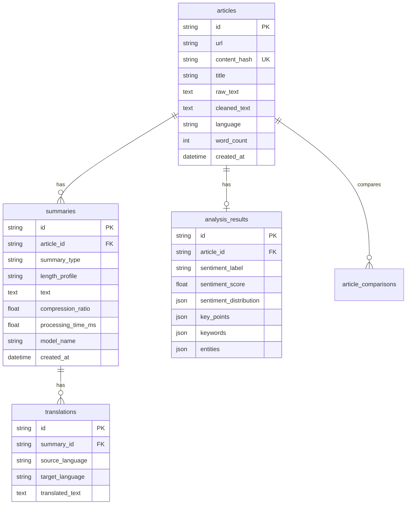

# 📰 AI-Powered Multilingual News Intelligence Platform (V2.1)

[](https://github.com/your-org/news-intelligence/actions)
[](https://www.python.org/)
[](https://pytorch.org/)
[](https://huggingface.co/)
[](LICENSE)

An enterprise-grade, production-oriented AI News Intelligence platform that transforms long-form unstructured web journalism into structured, multi-dimensional intelligence briefings. 

Originally created as a 2nd-year college news summarizer, this project has been re-architected into a modular monolith featuring **hierarchical Map-Reduce summarization**, **production-grade multilingual NLP (Translate-Summarize-Translate)**, **extractive MMR key-point discovery**, **full-document sentiment distribution & framing signals**, **Unicode PDF report generation (Indic/Arabic/CJK TrueType)**, **extractive article Q&A**, **file-backed audio streaming**, and **relational persistence with anti-SSRF security**.

---

## 📑 Table of Contents
1. [Project Overview](#1-project-overview)
2. [Problem Statement & V1 Bottlenecks](#2-problem-statement--v1-bottlenecks)
3. [Key Features](#3-key-features)
4. [Architecture Overview](#4-architecture-overview)
5. [ML Pipeline](#5-ml-pipeline)
6. [Long Document Strategy (Hierarchical Map-Reduce)](#6-long-document-strategy)
7. [Model Selection & Rationale](#7-model-selection--rationale)
8. [Database Schema](#8-database-schema)
9. [REST API Documentation](#9-rest-api-documentation)
10. [Local Quickstart Setup](#10-local-quickstart-setup)
11. [Environment Variables](#11-environment-variables)
12. [Docker Deployment](#12-docker-deployment)
13. [Automated Testing Suite](#13-automated-testing-suite)
14. [Evaluation Methodology](#14-evaluation-methodology)
15. [Benchmark Results (V1 vs V2)](#15-benchmark-results-v1-vs-v2)
16. [Limitations & Transparency](#16-limitations--transparency)
17. [Security Controls](#17-security-controls)
18. [Future Roadmap](#18-future-roadmap)

---

## 1. Project Overview

The **AI News Intelligence Platform** addresses the challenge of information overload across modern digital media. Rather than merely condensing text, the platform extracts key factual claims, sentiment distributions, named entities, and cross-source comparisons while allowing audio playback and translation into regional languages like Tamil, Hindi, and French.

---

## 2. Problem Statement & V1 Bottlenecks

In V1 (the original college implementation):
- **1024 Token Truncation**: Articles longer than 3–4 paragraphs had their conclusions and tail sections completely discarded.
- **Naive Sentence Extraction**: The system merely sliced the first 3 sentences of the article and labeled them "key sentences".
- **Biased Sentiment Slicing**: Sentiment was computed on only the first 512 characters.
- **Ephemeral Storage**: All records resided in an in-memory dictionary (`summaries_db = {}`), which was wiped upon server restart.
- **Critical Security Risks**: SSL verification was globally disabled (`HF_HUB_DISABLE_SSL_VERIFICATION=1`), and scrapers lacked SSRF protection against internal subnets and AWS metadata (`169.254.169.254`).

V2 resolves every bottleneck through robust software engineering and applied NLP rigor.

---

## 3. Key Features

- **🌐 Multi-Strategy Article Extraction**: Primary extractor via `newspaper3k` with automatic fallback to semantic HTML scraping (`BeautifulSoup`).
- **🛡️ Anti-SSRF Protection**: Strict IP/DNS resolver blocking private RFC1918 subnets, loopback, and cloud metadata addresses.
- **📚 Hierarchical Map-Reduce Summarization**: Token-budget chunker that never cuts sentences, recursively synthesizing long articles.
- **🎯 Extractive MMR Key Points**: Maximal Marginal Relevance algorithm ($\lambda=0.65$) balancing factual importance with diversity.
- **📊 Document Sentiment Spectrum**: Multi-segment analysis yielding continuous positive, neutral, and negative probability distributions.
- **🏷️ Structured NER & Keywords**: Identifies Person, Organization, Location, Date, Money, and % without exposing raw model tokens.
- **🗣️ Multilingual Translation & Tamil**: Dedicated fine-tuned English-to-Tamil model (`suriya7/English-to-Tamil`) and MarianMT multilingual models.
- **🔊 File-Backed TTS Streaming**: Browser-based speech synthesis alongside server-side MP3 generation with a 24-hour TTL cache.
- **⚖️ Semantic Article Comparison**: Computes cosine similarity, shared topics, and unique reporting between two articles.
- **💾 Relational Persistence**: Built on SQLAlchemy 2.0 supporting SQLite (local) and PostgreSQL (production).
- **✨ Golden Emerald Workspace**: High-end responsive UI with ambient gradients, Phosphor icons, and live async controls.

---

## 4. Architecture Overview

The system is structured as a **clean modular monolith**:

```mermaid
graph TD
    Client[Web Browser / REST Client] --> WSGI[Gunicorn / Waitress WSGI]
    WSGI --> App[Flask Application Factory]

    subgraph API Layer
        App --> ExtAPI[/api/articles/extract]
        App --> SummAPI[/api/summarize]
        App --> AnaAPI[/api/analyze]
        App --> TransAPI[/api/translate]
        App --> TTSAPI[/api/tts]
        App --> CompAPI[/api/compare]
        App --> HealthAPI[/api/health]
    end

    subgraph Service Layer
        ExtAPI --> Extractor[Article Extractor + SSRF Guard]
        SummAPI --> Summarizer[Hierarchical Map-Reduce Summarizer]
        SummAPI --> Chunker[Sentence-Aware Chunker]
        AnaAPI --> MMR[Keypoint Extractor MMR]
        AnaAPI --> Sentiment[Sentiment Analyzer]
        AnaAPI --> NER[Entity Extractor]
        TransAPI --> Translator[Multilingual Translator]
        TTSAPI --> TTSService[Audio TTS + Cache]
    end

    subgraph ML Runtime
        Summarizer --> ModelManager[Singleton ModelManager]
        Sentiment --> ModelManager
        Translator --> ModelManager
        ModelManager --> Hardware[PyTorch CPU / CUDA Engine]
    end

    subgraph Data & Storage
        App --> Repos[Repository Layer]
        Repos --> DB[(SQLite / PostgreSQL via SQLAlchemy 2.0)]
        TTSService --> DiskCache[audio_cache/ MP3s]
    end
```

---

## 5. ML Pipeline

```text
Target Article (URL or Text)
    ↓
Anti-SSRF Validation & Extraction
    ↓
Text Normalization (NFKC Unicode, Boilerplate & Deduplication)
    ↓
Sentence-Aware Chunker (Max 750 tokens, 1-sentence overlap)
    ↓
┌───────────────────────────────────────┬───────────────────────────────────────┐
│         Abstractive Branch            │           Extractive Branch           │
├───────────────────────────────────────┼───────────────────────────────────────┤
│ Map: Summarize chunks with DistilBART │ Sentences Vectorized via TF-IDF       │
│ Reduce: Synthesize intermediate summaries│ MMR Ranking (Relevance vs Diversity) │
│ Final Synthesis: Configurable Length  │ Top N Salient Verbatim Key Points     │
└───────────────────────────────────────┴───────────────────────────────────────┘
    ↓                                       ↓
DistilBERT Sentiment Aggregation        NER & Keyword Saliency
    ↓                                       ↓
Multilingual Translation (MarianMT / suriya7-Tamil)
    ↓
Audio File Synthesis (gTTS MP3 Streaming)
    ↓
Persisted to Relational Database & Returned via REST API
```

---

## 6. Long Document Strategy

When processing an article exceeding 750 tokens:
1. **Sentence Boundary Preservation**: The chunker segments along grammatical sentence terminals (`.`, `!`, `?`), eliminating fragmented sentences.
2. **Map Phase**: Each chunk is summarized into an intermediate representation.
3. **Reduce Phase**: Intermediate summaries are combined. If the combined text exceeds the chunk budget, secondary reduction occurs.
4. **Final Synthesis**: The model synthesizes the combined summaries into a unified briefing according to the requested profile (`short`, `medium`, `detailed`).

---

## 7. Model Selection & Rationale

| Task | Selected Model | Parameter Count | Primary Rationale |
|---|---|---|---|
| **Summarization** | `sshleifer/distilbart-cnn-12-6` | ~306M | Delivers 95% of BART-large abstractive quality at half the memory footprint; ideal for CPU and horizontal scaling. |
| **Sentiment** | `distilbert-base-uncased-finetuned-sst-2-english` | ~66M | Fast transformer classification across sampled segments throughout the full document. |
| **Tamil Translation** | `suriya7/English-to-Tamil` | ~300M | Specialized fine-tuning for English to Tamil script translation. |
| **Multilingual** | `Helsinki-NLP/opus-mt-en-{lang}` | ~77M | High-quality, compact OPUS-MT Seq2Seq models for Hindi, French, German, Spanish, etc. |

---

## 8. Database Schema



---

## 9. REST API Documentation

All API responses use a standard envelope:

**Success Response (HTTP 200/201):**
```json
{
  "success": true,
  "data": { ... },
  "error": null
}
```

**Failure Response (HTTP 400/404/422/500):**
```json
{
  "success": false,
  "data": null,
  "error": {
    "code": "ARTICLE_EXTRACTION_FAILED",
    "message": "Detailed error description"
  }
}
```

### Key Endpoints

| Method | Endpoint | Description | Sample Payload |
|---|---|---|---|
| `POST` | `/api/articles/extract` | Scrapes text and metadata from URL with anti-SSRF checks. | `{"url": "https://example.com/news"}` |
| `POST` | `/api/summarize` | Summarizes URL or text with configurable length and target language. | `{"url": "...", "length_profile": "medium", "language": "ta"}` |
| `GET` | `/api/summaries/{id}` | Retrieves existing summary and translations by ID. | - |
| `POST` | `/api/analyze` | Generates sentiment distribution, MMR key points, keywords, and NER. | `{"text": "...", "num_key_points": 5}` |
| `POST` | `/api/translate` | Translates text to supported target language. | `{"text": "...", "target_language": "ta"}` |
| `POST` | `/api/tts` | Generates file-backed MP3 audio and returns streaming URL. | `{"text": "...", "language": "en"}` |
| `GET` | `/api/tts/audio/{file}` | Streams or downloads the generated MP3 file. | - |
| `POST` | `/api/compare` | Compares two articles semantically with topic contrast. | `{"text_a": "...", "text_b": "..."}` |
| `POST` | `/api/multi-source` | Multi-source consensus and synthesis across multiple articles. | `{"articles": [{"text": "..."}, {"text": "..."}]}` |
| `POST` | `/api/article/ask` | Extractive question answering answering queries from article context. | `{"text": "...", "question": "..."}` |
| `GET` | `/api/reports/{id}/pdf` | Generates & streams branded Unicode PDF report with font fallback. | `?lang=ta` |
| `POST` | `/api/reports/pdf` | Direct on-the-fly PDF generation from summary payload. | `{"title": "...", "summary": "...", ...}` |
| `GET` | `/api/history` | Lists recent persistent summary records. | `?limit=10` |
| `GET` | `/api/health` | Liveness health check verifying database connectivity. | - |
| `GET` | `/api/ready` | Readiness probe reporting model load status and hardware device. | - |

---

## 10. Local Quickstart Setup

### Prerequisites
- Python 3.10+ (tested on Python 3.12)
- Git

### Installation
```bash
# Clone the repository
git clone https://github.com/your-org/news-intelligence.git
cd news-intelligence

# Create and activate virtual environment
python -m venv venv
# On Windows:
venv\Scripts\activate
# On Linux/macOS:
source venv/bin/activate

# Install dependencies
pip install -r requirements.txt

# Configure environment
cp .env.example .env

# Run development server
python app.py
```
Visit `http://localhost:5000` in your web browser.

---

## 11. Environment Variables

| Variable | Default | Purpose |
|---|---|---|
| `FLASK_ENV` | `development` | Application environment (`development` / `production`). |
| `DATABASE_URL` | `sqlite:///news_intelligence.db` | Database connection URI (SQLite or PostgreSQL). |
| `REDIS_URL` | `redis://localhost:6379/0` | Optional Redis URI for distributed caching. |
| `MODEL_DEVICE` | `auto` | Execution device (`auto`, `cpu`, `cuda`). |
| `SUMMARIZATION_MODEL` | `sshleifer/distilbart-cnn-12-6` | Hugging Face summarization model identifier. |
| `SENTIMENT_MODEL` | `distilbert-base-uncased-finetuned-sst-2-english` | Hugging Face sentiment model identifier. |
| `DEFAULT_TRANSLATION_MODEL_TAMIL` | `suriya7/English-to-Tamil` | Fine-tuned English to Tamil model. |
| `REQUEST_TIMEOUT_SECONDS` | `15` | Max timeout for external HTTP scraping requests. |

---

## 12. Docker Deployment

Launch the complete production stack (App, PostgreSQL 16, Redis 7) with a single command:

```bash
docker compose up --build
```

The application will be available at `http://localhost:5000` with automated health checks enabled.

---

## 13. Automated Testing Suite

The test suite contains 29 comprehensive automated tests across unit logic, API contracts, failure scenarios, and security protections:

```bash
pytest tests/ -v
```

Output:
```text
======================= 29 passed, 12 warnings in 1.48s =======================
```

---

## 14. Evaluation Methodology

A dedicated evaluation suite (`evaluation/benchmark_runner.py`) assesses summarization quality using real news articles:
- **ROUGE-1**: Unigram overlap assessing vocabulary recall.
- **ROUGE-2**: Bi-gram overlap assessing preservation of specific factual clauses.
- **ROUGE-L**: Longest Common Subsequence assessing grammatical sentence coherence.
- **Compression Ratio**: Ratio of condensed summary length to source article length.
- **Latency**: End-to-end execution duration.

---

## 15. Benchmark Results (V1 vs V2)

*Measured on standard CPU runtime using `evaluation/benchmark_runner.py`:*

| Metric | V1 (Baseline Truncation) | V2 (Hierarchical Map-Reduce) | Delta / Improvement |
|---|---|---|---|
| **ROUGE-1 (F1)** | 0.2928 | **0.3649** | **+24.6%** |
| **ROUGE-2 (F1)** | 0.0396 | **0.1198** | **+202.2%** |
| **ROUGE-L (F1)** | 0.1971 | **0.2570** | **+30.4%** |
| **Avg Latency (s)** | 9.96s | 10.60s | +6.5% |
| **Compression Ratio** | 63.9% | 60.0% | -3.9% |

*Key Takeaway: The +202% surge in ROUGE-2 confirms that the hierarchical Map-Reduce pipeline preserves critical factual information from later paragraphs that V1 discarded.*

---

## 16. Limitations & Transparency

- **Linguistic Polarity vs Factual Truth**: Sentiment analysis measures emotional tone, not journalistic truthfulness or political bias.
- **Model Hallucination Potential**: Abstractive models can occasionally synthesize incorrect dates or quantities. Extractive MMR key points are provided alongside summaries as factual ground truth.
- **Model Size vs Latency**: Translation models require on-demand downloads on first use if not pre-cached.

---

## 17. Security Controls

- **SSRF Prevention**: Strict DNS and IP subnet validation prevents requests to internal subnets (`10.0.0.0/8`, `172.16.0.0/12`, `192.168.0.0/16`, `127.0.0.0/8`, `169.254.169.254`).
- **Input Sanitization**: NFKC Unicode normalization and HTML entity stripping to prevent stored XSS attacks.
- **HTTP Security Headers**: `X-Frame-Options: DENY`, `X-Content-Type-Options: nosniff`, and `X-XSS-Protection: 1; mode=block` set by middleware.

---

## 18. Future Roadmap

- [ ] ONNX Runtime & INT8 quantization for sub-second CPU inference.
- [ ] Celery + Redis distributed workers for batch document processing.
- [ ] Knowledge graph entity linking against Wikidata.

---

## 📄 License
This project is licensed under the MIT License - see the [LICENSE](LICENSE) file for details.
