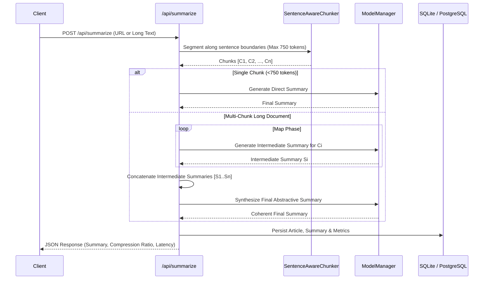
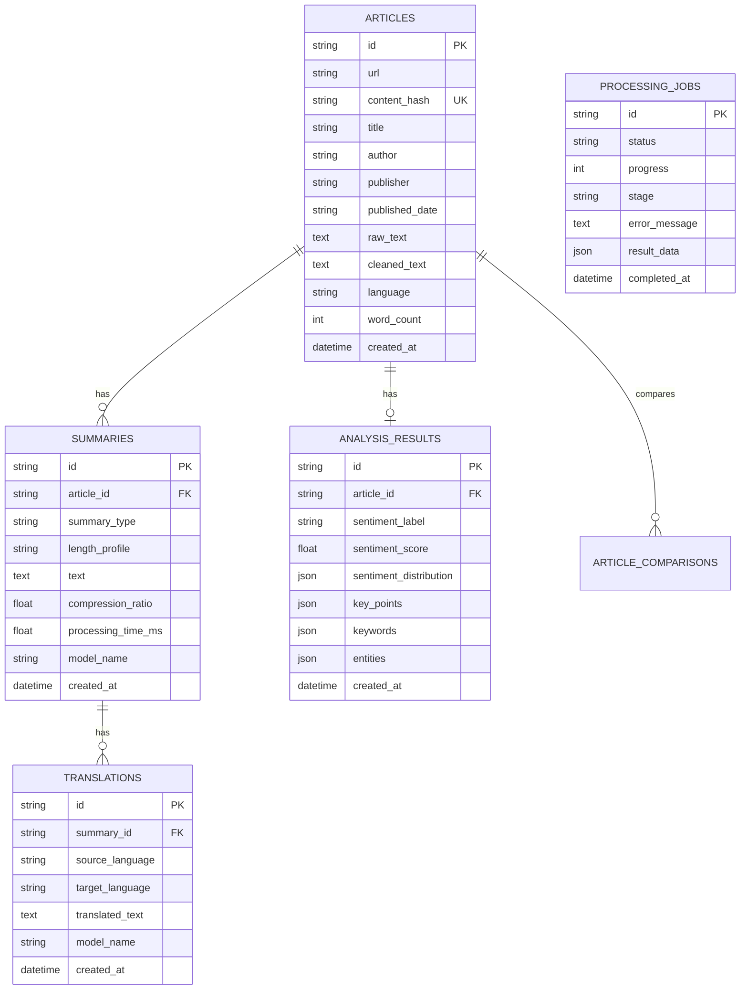

# System Architecture: AI News Intelligence Platform

## 1. High-Level Architecture

The platform is designed as a **production-oriented modular monolith** combining robust web extraction, NLP inference services, relational persistence, and secure REST APIs.

```mermaid
graph TD
    Client[Web Browser / API Client] -->|HTTP / JSON| ReverseProxy[Reverse Proxy / Gunicorn WSGI]
    ReverseProxy -->|Routes| FlaskApp[Flask Application Factory]

    subgraph API Layer
        FlaskApp --> WebUI[Web Dashboard & Shareable Reports]
        FlaskApp --> ArticlesAPI[/api/articles/extract]
        FlaskApp --> SummarizeAPI[/api/summarize]
        FlaskApp --> AnalysisAPI[/api/analyze]
        FlaskApp --> TranslateAPI[/api/translate]
        FlaskApp --> CompareAPI[/api/compare]
        FlaskApp --> AudioAPI[/api/tts]
    end

    subgraph Service Layer
        ArticlesAPI --> Extractor[Article Extractor + SSRF Guard]
        SummarizeAPI --> Summarizer[Hierarchical Map-Reduce Summarizer]
        SummarizeAPI --> Chunker[Sentence-Aware Chunker]
        AnalysisAPI --> MMR[MMR Key-Point Extractor]
        AnalysisAPI --> Sentiment[Multi-Segment Sentiment Analyzer]
        AnalysisAPI --> NER[Named Entity Recognizer]
        AnalysisAPI --> Keywords[TF-IDF Keyword Saliency]
        TranslateAPI --> Translator[Multilingual Translation Service]
        AudioAPI --> TTSService[File-Backed TTS + TTL Cache]
    end

    subgraph ML & Model Management
        Summarizer --> ModelManager[Thread-Safe Model Manager]
        Sentiment --> ModelManager
        Translator --> ModelManager
        ModelManager --> CPU_GPU[CPU / GPU PyTorch Runtime]
    end

    subgraph Storage Layer
        FlaskApp --> Repositories[Repository Pattern]
        Repositories --> DB[(SQLite / PostgreSQL via SQLAlchemy 2.0)]
        TTSService --> FileCache[Disk Audio Cache]
        Summarizer --> Cache[In-Memory / Redis Cache]
    end
```

---

## 2. Long-Document Hierarchical Summarization Pipeline



---

## 3. Data Model Schema


